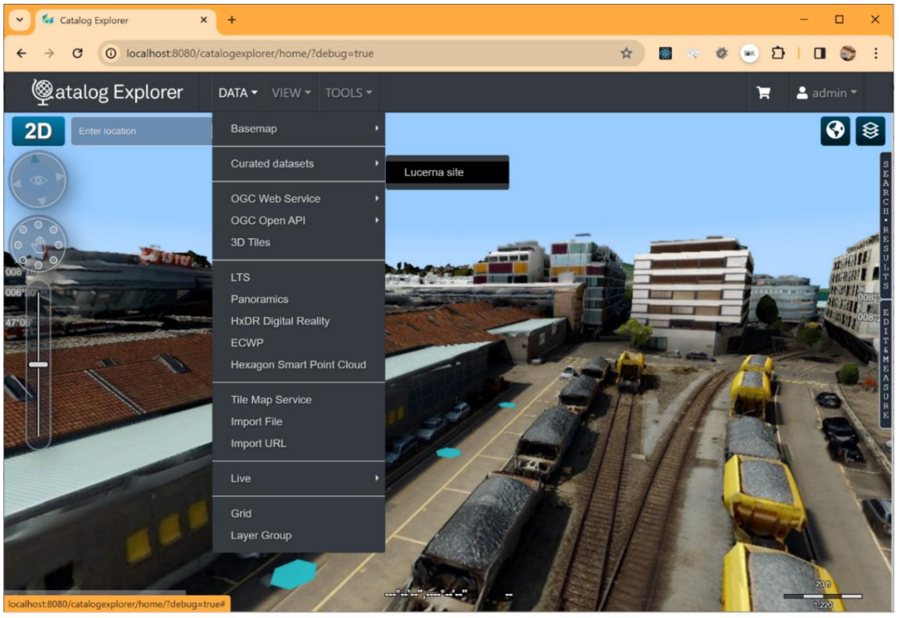
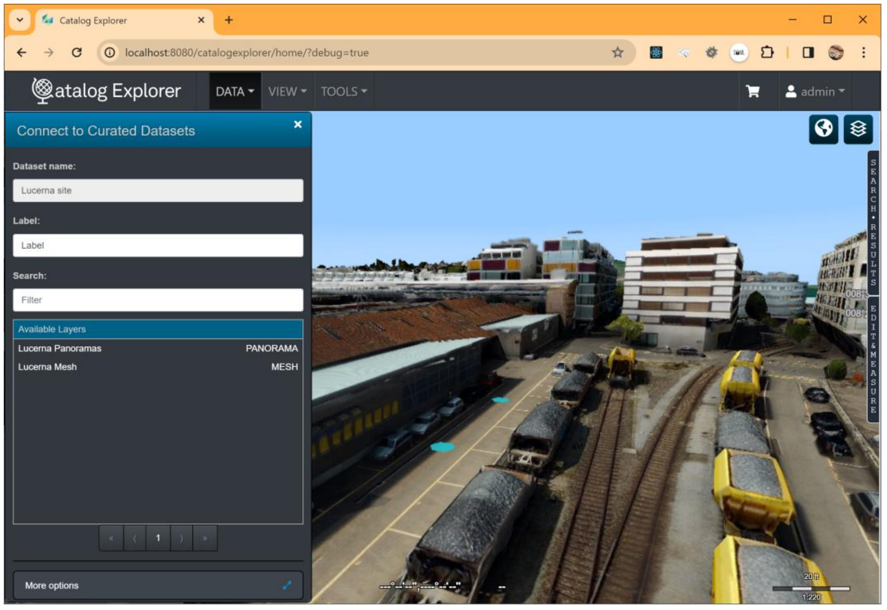

# CatalogExplorer Custom Extensions
## Listing Curated Assets

Consider a scenario where you aim to simplify access to multiple assets. For instance, your company
hosts various layers, and instead of requiring users to navigate through a form to access a dataset, you
wish to offer the option to open a layer with just one click. The list of assets can either be static or
dynamically provided by a REST API.

The provided hook is called app.webservices, which accepts an array of available catalogs. The action is
a user-defined function that receives a callback. This callback must contain an array of available services.
Basic query functionality is expected to be provided, allowing for search and sorting. Refer to the example
below for clarification.

### Procedure

Let's reuse the code we wrote in sample05

1. Copy the contents of the folder sample05 to sample06
2. Navigate to the sample06 folder and start the web server using:
```shell
serve public -C
```
3. Edit the content of index.js inside the public folder with the following content:

```JavaScript
window.catex = {
    app: {
        webservices: [{
            id: "cs1-id",
            label: "Lucerna site",
            title: "A custom service that provides a list of assets located in Lucerna",
            action: function(o, callback) {
                if (typeof callback === "function") {
                    const results = localDatasets(o);
                    callback(results);
                }
            }
        }]
    }
}

function localDatasets(query) {
    const rows = [
        {
            id: "1.1",
            label: "Lucerna Panoramas",
            title: "PANORAMA",
            type: "PANORAMA",
            endpoint: "https://sampledata.luciad.com/data/panoramics/LucernePegasus/cubemap_final.json ",
        },
        {
            id: "1.2",
            label: "Lucerna Mesh",
            title: "3D Tiles",
            type: "MESH",
            endpoint: "https://sampledata.luciad.com/data/ogc3dtiles/LucerneAirborneMesh/tileset.json ",
        }
    ]
    const matches = rows.filter(r => r.label.toLowerCase().indexOf(query.search.toLowerCase()) !== -1);
    const pageNumber = Number(query.pageNumber);
    const pageSize = Number(query.pageSize);
    const paginated = matches.sort((a, b) => a > b ? 1 : a < b ? -1 : 0).slice(pageNumber * pageSize, (pageNumber + 1) * pageSize);
    const results = {
        rows: paginated,
        matches: matches.length,
        total: rows.length
    }
    return results;
}
```
5. Reload Catalog Explorer:

http://localhost:8080/catalogexplorer/home/

6. Open a WFS layer, such as:
   
https://sampleservices.luciad.com/wfs
7. Within the layer, access City 125.
8. Choose a city from the map, then right-click on it.

### Expected outcomes:
* The Catalog Explorer should load simultaneously with the custom extension.
* A new menu item titled "Curated datasets" will appear in the Data menu.
* The ability to offer multiple datasets.
* Upon clicking on a dataset, a form will appear, presenting a list of all available assets within that dataset.




### Activity:
Add more elements to the app.webservices array to define your own catalogs.

## Run the solution

```shell
serve public -C
```

Once running you need to configure CatalogExplorer custom extensions to retrieve the Javascript and CSS from these locations:

JavaScript (CDN):
```
http://localhost:3000/index.js
```

CSS (CDN):
```
http://localhost:3000/index.css
```

