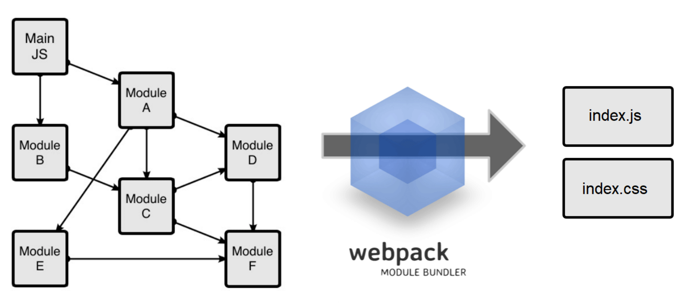

# CatalogExplorer Custom Extensions
# Custom Extension with Webpack and Typescript

In all the previous examples our custom extension consisted of only one single JavaScript file. However,
in complex projects it is convenient to split our code in multiple files to make modular, flexible, and
scalable applications. Moreover, our application will often require using third-party libraries, for instance
from NPM.

Webpack provides an ideal solution for this task, enabling us to bundle our JavaScript and CSS files for
production. Additionally, it offers a development server that facilitates debugging our code as we write it.

In this exercise, we will use webpack server to write and debug our code and we will compile for
production once our code is ready.

While TypeScript is optional, it is highly recommended. It streamlines code writing with features like
autocomplete, automatic library imports, and real-time detection of syntax or type errors during code
composition or compilation.

In this exercise you will learn how to setup webpack for development and production purposes to create a
Custom Extension. It will also make use of Typescript and SASS/SCSS.

The objective of this training is not to provide a comprehensive course on Webpack but to offer helpful
hints on the necessary changes required to use it for debugging and compiling a Custom Extension.

To create a custom extension, you need to configure your webpack to bundle all JavaScript or TypeScript
code into a single index.js file and bundle all styles into a single index.css file.



To use the webpack development server we need to make sure the bundler exposes the in-memory
index.js and index.css in full together with the source maps. We also need to make sure that the CORS is
enabled.


## Procedure
1. Go to folder sample09. You will notice already contains a webpack project defined in
   “webpack.config.js” which contains all the required settings
2. Typescript has also been configured as you seen in the file tsconfig.json, You will notice also that the
   folder interfaces contain the file catex.ts with all the type definitions required by Custom Extensions
3. Basic linting has also been configured (optional) eslintrc.js
4. To run this project type
```shell
   npm install
```
5. To run this project in development mode type
```shell
   npm start
```
6. The webpack development server is configured to serve at localhost:5000, go to the Catalog Explorer
   administration dashboard and configure it to look for the custom extension at:
   * JavaScript: http://localhost:5000/index.js
   * CSS: http://localhost:5000/index.css
7. Reload Catalog Explorer and verify that Catalog Explorer and the custom extension are both loaded
   simultaneously.
8. Verify that you can debug the code in Typescript in your web browser.
9. Build for production. To build for production simply run the script.
```shell
   npm run build
```
   Your index.js and index.css will be placed inside the dist/customextension folder. You can simply
   copy those files to your production web server and they are ready to use

## Activity
Run webpack in development mode and make some changes, for instance add a new action that displays
a form using JSON Schema asking for name, date of birth, address, and phone. Place the code of your
action in a separate file to test the modularity. Add a third-party library to your project using “npm install”

<strong>HINT:</strong> The main file (entry point) is located at `src/index.ts`. This is your starting point, modify it at your
convenience and try to split your code into modules.


# Run Solution

## To install
```
npm install
```

## To debug
```
npm start
```

## To Build
```
npm run build
```

Once you have generated your bundle you can copy the files to any webserver and serve them from there.

## To test production build
```
npm run serve
```

Once running you need to configure CatalogExplorer custom extensions to retrive the Javascript and CSS from these locations:

JavaScript (CDN):
```
http://localhost:5000/index.js
```

CSS (CDN):
```
http://localhost:5000/index.css
```

